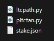
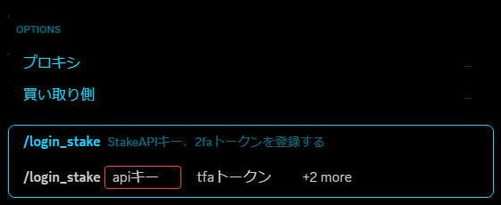
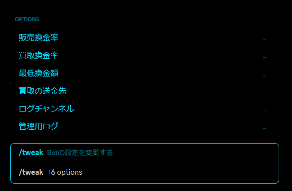

# Stake-kankin-bot-document
Stake換金で有名なPayPay -> LTCや、LTC -> PayPayにすることができるDiscordのBotです  
説明にある通り無料で配布してるわけではないので、サーバー (https://discord.gg/aSyaAK7Ktm) かDiscordのDM (.taka.) にお願いします  
## 始める前に
  
この3つを同一ディレクトリに置いたらltcpath.pyを編集しましょう  
##### ltcpath.py
```python
TOKEN = ''
timeout=300
activity=""
adminlist=['614025927877197834','','']
path="C:/Users/TAKA/Documents/data/"

logj="log.json"
mane="maneron.json"
black="black.json"
block="block.json"
text="num.txt"

logincom="</login:>"
```
```TOKEN``` / Discord Botのトークン  
```timeout``` / LTC -> PayPay換金のタイムアウト (秒)  
```activity``` / Botのアクティビティー  
```adminlist``` / コマンドを使用可能なユーザーのID  
```path``` / Botのデータを保存するフォルダーのパス  
```logj ～ text``` / ファイル名 (変更する必要はナシ)  
```logincom``` / ログインコマンドのID (特になくても問題ナシ)  
設定が終わったらBotが起動できます  
## Botが起動したら
#### 主要なコマンド、少し説明をした方がいいコマンドについて記述しておきます  
```/login_stake```   
StakeのAPIキーと2faトークンを設定します  
  
買い取り側(boolan)をTrueにすると買い取り側のデータに書き込みます  
プロキシも1度設定しておいてください (PayPayに使うプロキシと同じでだいじょうぶ)  
```/login_pay```  
電話番号、パスワード、プロキシでPayPayアカウントにログインできます  
番号に数字を入力すると、複数アカウント用の番号を設定できます (入力しなかったら1.jsonで保存される)  
```/tweak```  
Botの設定を変更できます  
  
基本書いてある通りです  
管理者用ログにはエラーや細かいものが記述されたログを送信します  
ふつうのログチャンネルは実績みたいなものです  
```/black / /block```  
この2つはちゃんと違うコマンドです  
/blackは換金詐欺 (お金だけ受け取って換金をしない) を仕掛けるユーザーのIDを登録します  
/blockは換金をさせないユーザーのIDを入力します (お金も受け取らず弾く)  
続きは明日かきます
