# Stake-kankin-bot-document
Stake換金で有名なPayPay -> LTCや、LTC -> PayPayにすることができるDiscordのBotです  
説明にある通り無料で配布してるわけではないので、サーバー (https://discord.gg/aSyaAK7Ktm) かDiscordのDM (.taka.) にお願いします  
またもともとソースコードを流す予定ではなかったので、僕が自分でみてわかりやすい変数名だったり仕様があったりします  
## 始める前に
### 必要なモジュール
- discord.py
- requests
- tls_client
- PayPaython

すべて```pip install ○○```でインストールできます
### セットアップ
  
この3つを同一ディレクトリに置いたらltcpath.pyを編集しましょう  
##### ltcpath.py
```python
TOKEN = ''
timeout=300
activity=""
adminlist=['614025927877197834','','']
path="C:/Users/TAKA/Documents/data/"

logj="log.json"
mane="maneron.json"
black="black.json"
block="block.json"
text="num.txt"

logincom="</login:>"
```
```TOKEN``` / Discord Botのトークン  
```timeout``` / LTC -> PayPay換金のタイムアウト (秒)  
```activity``` / Botのアクティビティー  
```adminlist``` / コマンドを使用可能なユーザーのID  
```path``` / Botのデータを保存するフォルダーのパス  
```logj ～ text``` / ファイル名 (変更する必要はナシ)  
```logincom``` / ログインコマンドのID (特になくても問題ナシ)  
設定が終わったらBotが起動できます  
## Botが起動したら
#### 主要なコマンド、少し説明をした方がいいコマンドについて記述しておきます  
```/login_stake```   
StakeのAPIキーと2faトークンを設定します  
  
買い取り側(boolan)をTrueにすると買い取り側のデータに書き込みます  
プロキシも1度設定しておいてください (PayPayに使うプロキシと同じでだいじょうぶ)  
```/login_pay```  
電話番号、パスワード、プロキシでPayPayアカウントにログインできます  
番号に数字を入力すると、複数アカウント用の番号を設定できます (入力しなかったら1.jsonで保存される)  
```/tweak```  
Botの設定を変更できます  
  
基本書いてある通りです  
管理者用ログにはエラーや細かいものが記述されたログを送信します  
ふつうのログチャンネルは実績みたいなものです  
```/black / /block```  
この2つはちゃんと違うコマンドです  
```/black```は換金詐欺 (お金だけ受け取って換金をしない) を仕掛けるユーザーのIDを登録します  
```/block```は換金をさせないユーザーのIDを入力します (お金も受け取らず弾く)  

...その他はコマンドの説明通りです  
## 動作
### 管理者用ログ  
  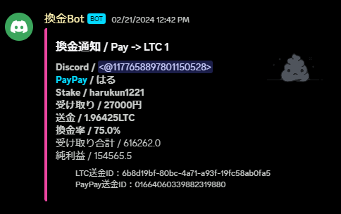  
  Pay -> LTC 数字 がタイトルになります  
  数字の部分は使ったPayPayアカウントの番号です  
  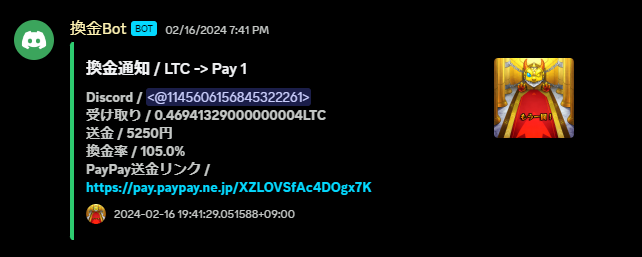  
  買取の時は緑ででてきます
### ふつうのログ  
  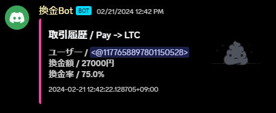  
  表示される情報が少なくなっただけです  
  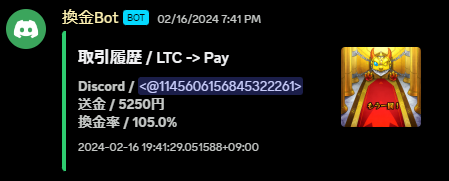  
  こっちも買取は緑になります  
### HarfSheetエラー  
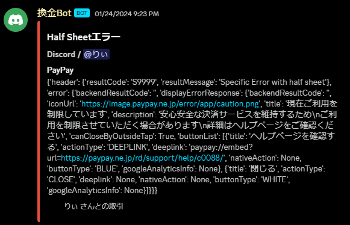  
PayPayのエラーです  
自分側のPayPayアカウントが悪い場合もあるし、相手側に問題がある場合もあります  
### 換金エラー  
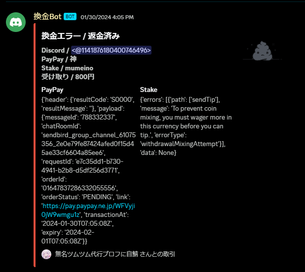  
Stake側にエラーが起きた時に送信されます  
だいたいコインミキシング、2faトークン、送金最低金額を下回った時です  
このエラーがでると換金ボタンが消され、換金をストップさせます  
自動返金機能はユーザーからオン/オフが選べます  
### アンチ資金洗浄  
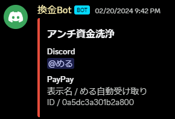  
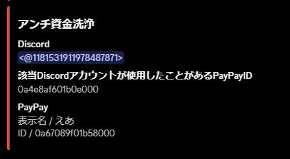  
このBotで換金したことがあるDiscordのユーザーID / PayPayのユーザーIDはすべて記録されています  
エラーがでてもアンチ資金洗浄だったとしても記録され、ユーザー側が抜けようとするとそれも記録されます  
ユーザーIDのリンクを解除するには```/unlink```を使いますが、ユーザー側が無理して抜けようとしてた場合このコマンドから消すのは大変な状況になる場合があります  
ちょっとこの仕様はきつすぎるかもしれませんが、僕が最初に作ってと依頼されたオーナーさんにガチガチにしてほしいと言われたのでこうなりました  
どうしても解除できない場合は、maneron.jsonを消すとすべてのリンクが解除されます  
## コマンド一覧
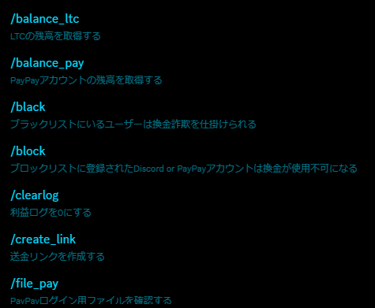  
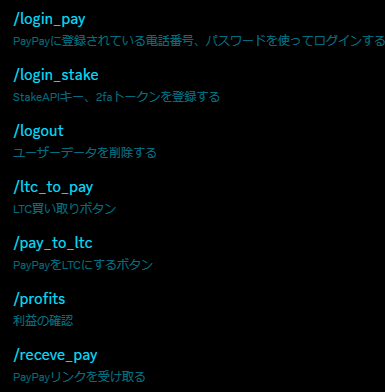  
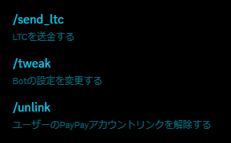  
## コンタクト
サーバー / https://discord.gg/aSyaAK7Ktm  
Discord / .taka.
